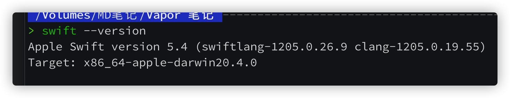
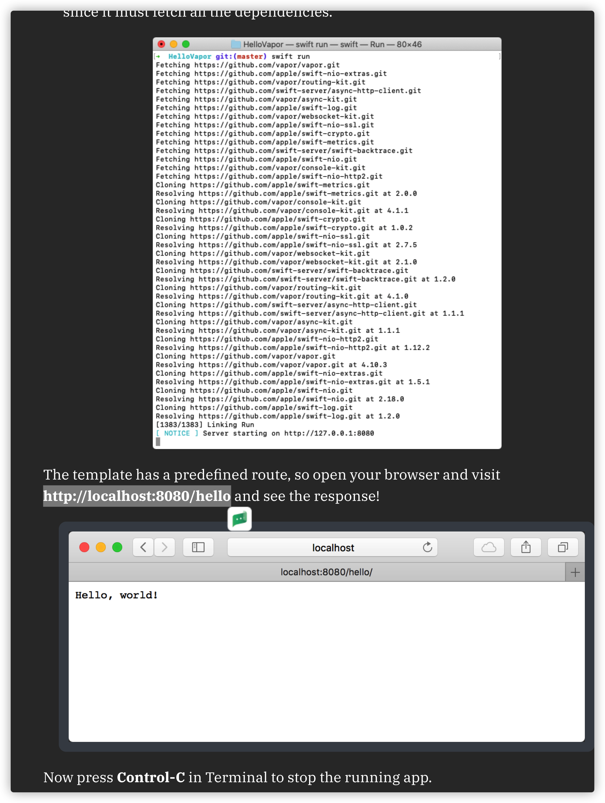
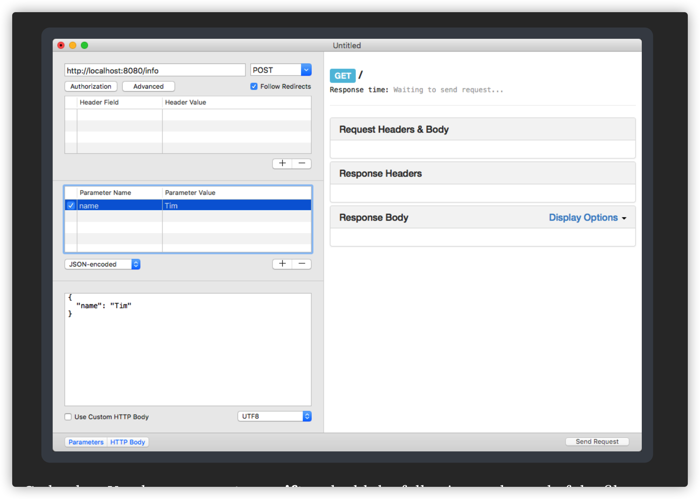
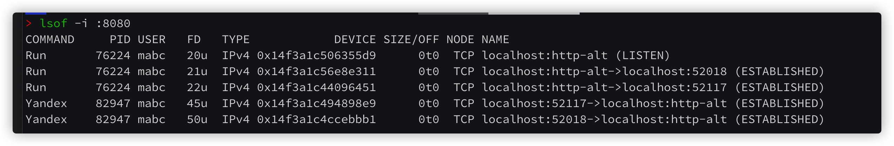
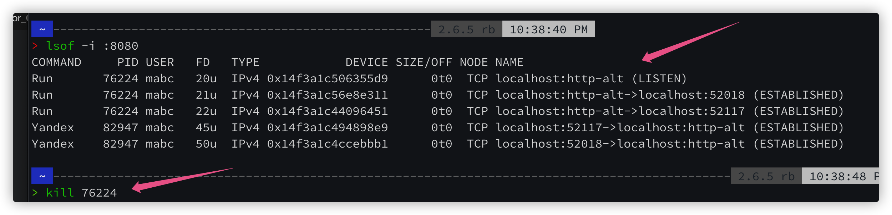
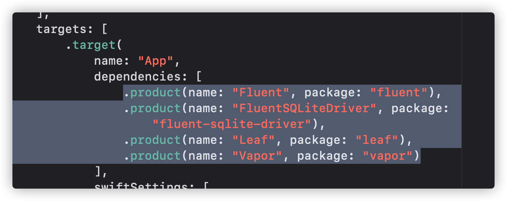

https://www.raywenderlich.com/11555468-getting-started-with-server-side-swift-with-vapor-4

```shell
brew install vapor
# 安装 vapor -> 一般 brew 会先自己更新 然后再去下载 vapor
vapor
# 启动 vapor 检查是否安装成功
> vapor
Usage: vapor <command>

Vapor Toolbox (Server-side Swift web framework)

Commands:
       build Builds an app in the console.
       clean Cleans temporary files.
      heroku Commands for working with Heroku
         new Generates a new app.
         run Runs an app from the console.
  supervisor Commands for working with Supervisord
       xcode Opens an app in Xcode.

Use `vapor <command> [--help,-h]` for more information on a command.
Error: Error: Missing command
>
# 会弹出以上一大堆东西 介绍 让你怎么使用这个 vapor 软件
swift --version
# 查看 swift 的版本
# 1
git clone https://github.com/vapor/toolbox.git
# 2
cd toolbox
# 3
git checkout 18.0.0
# 4
swift build -c release --disable-sandbox --enable-test-discovery
# 5
mv .build/release/vapor /usr/local/bin
# 安装 toolbox 并且设置为 非沙箱模式 用来这个程序可以操作其他程序

mkdir ~/vapor
cd ~/vapor

vapor new HelloVapor
# 创建新的 vapor 项目

# 1
cd HelloVapor
# 2
swift run

# http://localhost:8080/hello 输入浏览器就可以收到 hello world
```



fluent 是 swift 里操作 sql nosql 数据库的框架



```shell
open .
open Package.swift # 打开文件 修改一些内容
```

```swift
app.get("hello", "vapor") { req -> String in
  return "Hello Vapor!"
}

// 1
app.get("hello", ":name") { req -> String in
  //2
  guard let name = req.parameters.get("name") else {
    throw Abort(.internalServerError)
  }
  // 3
  return "Hello, \(name)!"
}

struct InfoData: Content {
 let name: String
}

// 利用 RESTed 软件进行测试 
```



```swift
// 1
app.post("info") { req -> String in
  // 2
  let data = try req.content.decode(InfoData.self)
  // 3
  return "Hello \(data.name)!"
}

struct InfoResponse: Content {
  let request: InfoData
}

// 1
app.post("info") { req -> InfoResponse in
  let data = try req.content.decode(InfoData.self)
  // 2
  return InfoResponse(request: data)
}
// 返回 JSON 数据的代码
```

`swift package update` 更新 package 


---

## 问题

解决在进程上的服务导致的报错 -> Thread 1: Fatal error: Error raised at top level: bind(descriptor:ptr:bytes:) failed: Address already in use (errno: 48)

`lsof -i :8080` 查看端口上的进程



使用 `kill` 命令终结 



重新编译运行

OR 或者

在 configure.swift 文件里加入以下代码 改变端口

```swift
let serverConfigure = NIOServerConfig.default(hostname: "0.0.0.0", port: 9090)
services.register(serverConfigure)
```


**复杂问题**

dependency 'leaf' is not used by any target

需要在 package 文件里的 targets 里面加入 依赖



不知道为什么 `vapor new proj` 的时候第一次就成功载入这些依赖 但是后面就会出现错误... 

删掉重新做了很多次, 依旧如此, 知道打开 package 文件对比正常的项目 加入了 正确的依赖...

然后项目报错各种的 module fluent could not be found 之类的报错!!! 耗时非常久

教训 -> 多多谷歌 -> 正确谷歌